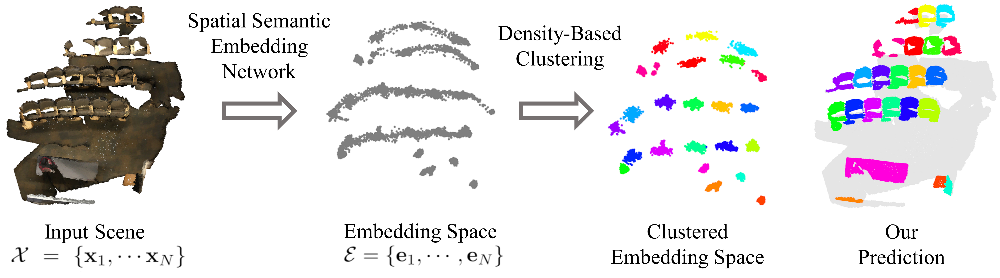

# Spatial Semantic Embedding Network
This repository contains code for [Spatial Semantic Embedding Network:Fast 3D Instance Segmentation with Deep Metric Learning](https://arxiv.org/abs/2007.03169) by Dongsu Zhang, Junha Chun, Sang Kyun Cha, Young Min Kim.
We are currently 3rd place on [ScanNet 3D Instance Segmentation Challenge](http://kaldir.vc.in.tum.de/scannet_benchmark/index.php?metric=ap) on AP.



Code for running pretrained network, visualizing the validation results on ScanNet, and training from scratch is available. 
The code has been tested on Ubuntu 18.04 and CUDA 10.0 environment.
The following are guides for installation and execution of the code.
Our project uses [Minkowski Engine](https://github.com/StanfordVL/MinkowskiEngine) for constructing the sparse convolutional network.

## Installation
 **Anaconda and environment installations**
```
conda create -n ssen python=3.7
conda activate ssen
conda install openblas
pip install -r requirements.txt
conda install pytorch==1.3.1 torchvision==0.4.2 cudatoolkit=10.0 -c pytorch
pip install MinkowskiEngine==0.4.2
```

## Evaluate
To visualize the outputs of our model,
1. Download semantic segmentation model, instance segmentation model, example point cloud from [google drive](https://drive.google.com/open?id=1ltdajPcVLgy45XtYhkdD24PRC-f_-ANS).
   The semantic segmentation model was pretrained on [Spatio Temporal Segmentation](https://github.com/chrischoy/SpatioTemporalSegmentation),
   but it is slightly different from the Spatio Temporal Segmentation, since the semantic labels of the instance segmentation is slightly different from semantic segmentation in ScanNet.
   Both of the models are pretrained on train and validation set and the `example_scene.pt` preprocessed point cloud from test set.
2. Place the files as below.
```
{repo_root}/
 - data/
   - models/
     - instance_model.pt
     - semantic_model.pt
   - example_scene.pt
```
Then run 
```
python eval.py
```

## Visualize validation results on ScanNet scenes
The validation results are on [google drive](https://drive.google.com/open?id=1maCvX1m1Bdu6OFS43soqfx__zljB_fCG)
Download the scenes and run 
```
python visualize.py --scene_path {scene_path}
```
The semantic labels from the visualizations were ran with 10 rotations.

## Train ScanNet from scratch
### Download ScanNet dataset
Download [ScanNet](http://www.scan-net.org/) from homepage and place them under `./data/scannet`.
You need to sign the terms of use.
The data folders should be placed as following.
```
{repo_root}/
 - data/
   - scannet/
     - scans/
     - scans_test/
     - scannet_combined.txt
     - scannet_train.txt
     - scannet_val.txt
```
Our model preprocesses all the point cloud into `.pt` file.
To preprocess data, run
```
python -m utils.preprocess_data
```
Our network also requires predicted semantic labels for training.
From [Spatio Temporal Segmentation](https://github.com/chrischoy/SpatioTemporalSegmentation)’s model zoo, download ScanNet pretrained model (train only) and place them at `./data/models/MinkUNet34C-train-conv1-5.pth`.
We found that using transfer learning from semantic segmentation model greatly reduced time for training. 
```
python -m utils.preprocess_semantic
```
The output tensor created has postfix of `{scene_name}_semantic_segment.pt` which is tensor of `N x 8` where N is the number of points.
Indices [0:3] are coordinates, [3:6] are color features, [7:8] are (ground truth) semantic and instance label and the [8] is the predicted semantic label by pretrained semantic label.

### Train
To train the instance segmenation model, run
```
python main.py
```
For using transfer learning, download pretrained model from [Spatio Temporal Segmentation](https://github.com/chrischoy/SpatioTemporalSegmentation). 

For different training hyperparameters, you may change the configs in `configs/` folder.
For logging the training and visualizing the embedding space, run
```
tensorboard --logdir log --port 8123
```

## Citing SSEN

If you use the SSEN, please cite:
- [Spatial Semantic Embedding Network:Fast 3D Instance Segmentation with Deep Metric Learning](https://arxiv.org/abs/2007.03169)
```
@inproceedings{zhang2020ssen,
    author = {Zhang, Dongsu and Chun, Junha and Cha, Sang and Kim, Young Min},
    title = "{Spatial Semantic Embedding Network: Fast 3D Instance Segmentation with Deep Metric Learning}",
    booktitle={arXiv preprint arXiv:2007.03169},
    year={2020}
}
```

